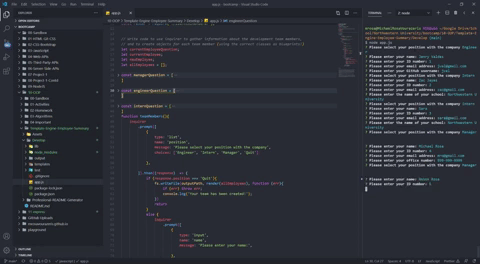

# Template Engine Employee Summary

## Description 
This project has been built so that a user can give info about each of their team members, and have it generate to a page with all team members info.

---

## Table of Contents

* [Installation](#installation)
* [Usage](#usage)
* [Screenshots](#screenshots)
* [Contributing](#contributing)
* [Tests](#tests)
* [Deployed-Site](#deployed-site)
* [Questions](#questions)
* [License](#license)

---

## Installation
1) Copy the HTTPS link from repository 
2) Open the folder you wish to add this application to in your code editor. 
3) Open the integrated terminal in the selected folder. 
4) Run git clone and paste HTTPS link from repository. 
5) Run "npm I" to install  the modules associated with this application.

---

## Usage 

---

## Screenshots 

---

## Contributing
Anyone can contribute to this file by forking the repo, adding their code to the application, and then send me a pull request so the main branch can be updated.

---

## Tests
[Test of the application](https://drive.google.com/file/d/1SXFQHYR4d8KqeB2PrXxSEZnSfD_-DccL/view?usp=sharing)

---

## Deployed Site
[Live Site](https://mrosavourazeris.github.io/Template-Engine-Employee-Summary/)

---

## Questions
My GitHub username is: mrosavourazeris

You can find my GitHub profile by clicking this link: [My GitHub Profile](https://github.com/mrosavourazeris)

If you have any questions you can email me at: [My Email](test@test.com)

---

## License
Licensed under 

### MIT License

Permission is hereby granted, free of charge, to any person obtaining a copy
of this software and associated documentation files (the "Software"), to deal
in the Software without restriction, including without limitation the rights
to use, copy, modify, merge, publish, distribute, sublicense, and/or sell
copies of the Software, and to permit persons to whom the Software is
furnished to do so, subject to the following conditions:

The above copyright notice and this permission notice shall be included in all
copies or substantial portions of the Software.

THE SOFTWARE IS PROVIDED "AS IS", WITHOUT WARRANTY OF ANY KIND, EXPRESS OR
IMPLIED, INCLUDING BUT NOT LIMITED TO THE WARRANTIES OF MERCHANTABILITY,
FITNESS FOR A PARTICULAR PURPOSE AND NONINFRINGEMENT. IN NO EVENT SHALL THE
AUTHORS OR COPYRIGHT HOLDERS BE LIABLE FOR ANY CLAIM, DAMAGES OR OTHER
LIABILITY, WHETHER IN AN ACTION OF CONTRACT, TORT OR OTHERWISE, ARISING FROM,
OUT OF OR IN CONNECTION WITH THE SOFTWARE OR THE USE OR OTHER DEALINGS IN THE
SOFTWARE.
